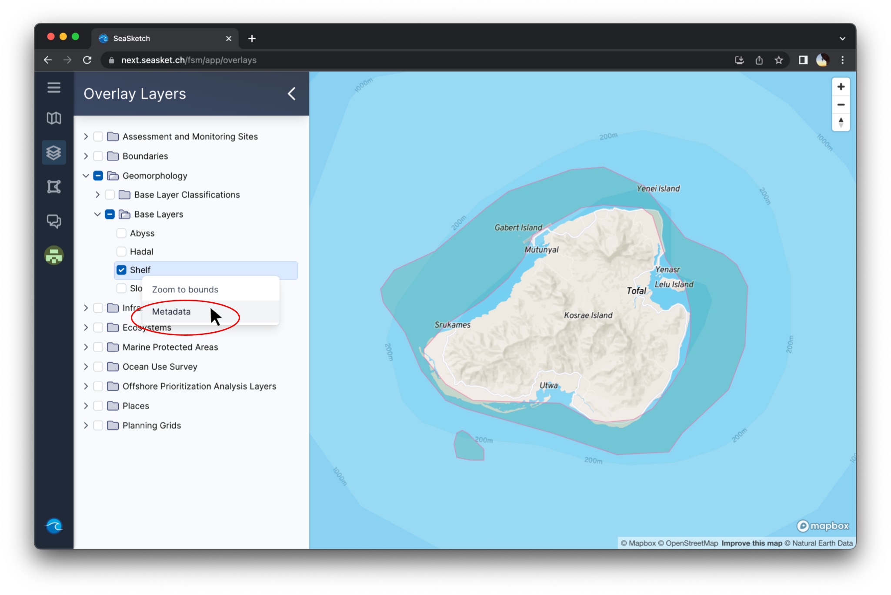

# Data Layers


This article covers:&#x20;

* [Viewing data in the map viewer](data-layers.md#undefined)
* [Changing basemaps](data-layers.md#changing-basemaps)
* [Viewing the legend](data-layers.md#undefined)
* [Adjusting layer order and transparency](data-layers.md#undefined)


## Viewing Data Layers in the Map Viewer

To view the list of data layers contained in the project click 'Overlay Layers' or the layer stack icon.\
\
In most projects, layers will be organized into folders. Click the arrow  next to a folder to expand the contents. Click a layer to add it to the map. You can add multiple layers at a time. If you are unable to select a layer, it is most likely restricted and you need to be granted access to view it.

<figure><figcaption>
Adding data layers to mapviewer
</figcaption></figure>

## Layer Values

Some layers will display their attributes when you hover your cursor over them. This may be a feature classification (like the example below), or a pixel value.

<figure><figcaption>
Hovering over a layer to reveal attribute value
</figcaption></figure>

## Viewing Metadata

To view a layer's metadata (information about the layer), right click and select 'Metadata' from the drop down menu. The information contained in the metadata will depend on what the project administrators chose to include.

<figure><figcaption>
Viewing a layer's metadata
</figcaption></figure>
