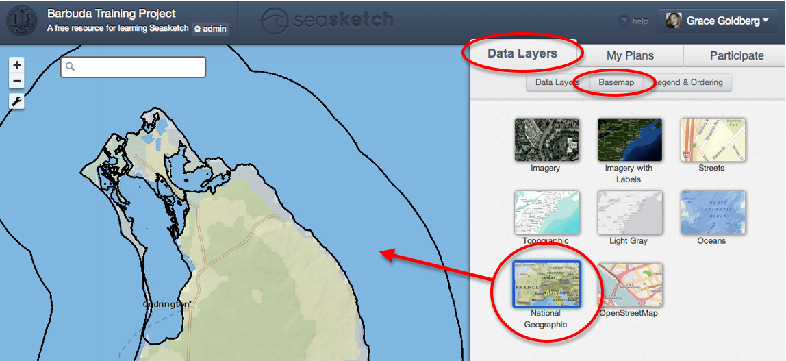
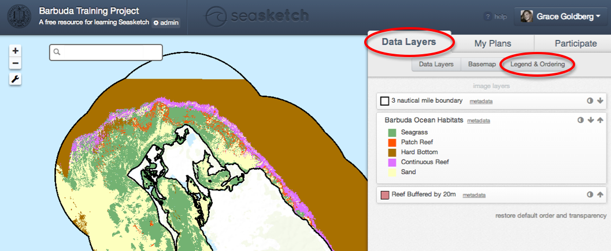

# Data Layers


This article covers:&#x20;

* [Viewing data in the map viewer](data-layers.md#undefined)
* [Changing basemaps](data-layers.md#changing-basemaps)
* [Viewing the legend](data-layers.md#undefined)
* [Adjusting layer order and transparency](data-layers.md#undefined)


## View Data in the Map Viewer

Select the Data Layers tab, and then theData Layers sub-tab (this may already be selected).

\-**Explore the layer tree** by scrolling through data, or using the search bar at the top.  The search bar allows you to search by the name of the layer.

<figure><figcaption></figcaption></figure>

\-**View data** in the map at left by clicking the small check box to the left of the data layer name.  Click the check box again to hide the data layer.

\-**Data layers may be grouped**.  Click the small grey arrow to the left of a group of layers to see the individual layers contained in the group.  You can turn the whole group on and off, or turn layers on and off individually.&#x20;

\-**Zoom to layer extent**, by right clicking on the layer.  Select zoom to extent from the drop down menu.

## Changing Basemaps

<figure><figcaption>
Changing a basemap
</figcaption></figure>

**Basemaps** are background maps on which the project data is visualized. &#x20;

\-Select ‘Basemap’ within the Data Layers tab&#x20;

\-Select a different basemap by clicking on one of the 8 standard ESRI options displayed in the boxes

## Viewing the Legend

<figure><figcaption>
Viewing the legend
</figcaption></figure>

View symbology of the data layers displayed.  Notice there are three layers displayed on the map.  All three have a light box that decodes what the map symbols represent.

\-**Change the order** of how data is displayed by clicking on the arrows at the far right of each data layer name.  This can be helpful when viewing many data layers simultaneously.

\-**Adjust transparency** by clicking on the shaded circle at the far right of the data layer name.  A slider bar will appear, and you may slide from opaque down through levels of transparency.  This can be helpful when viewing many data layers simultaneously.

\-**Restore default order and transparency** by clicking the link at the bottom right of the legend.
