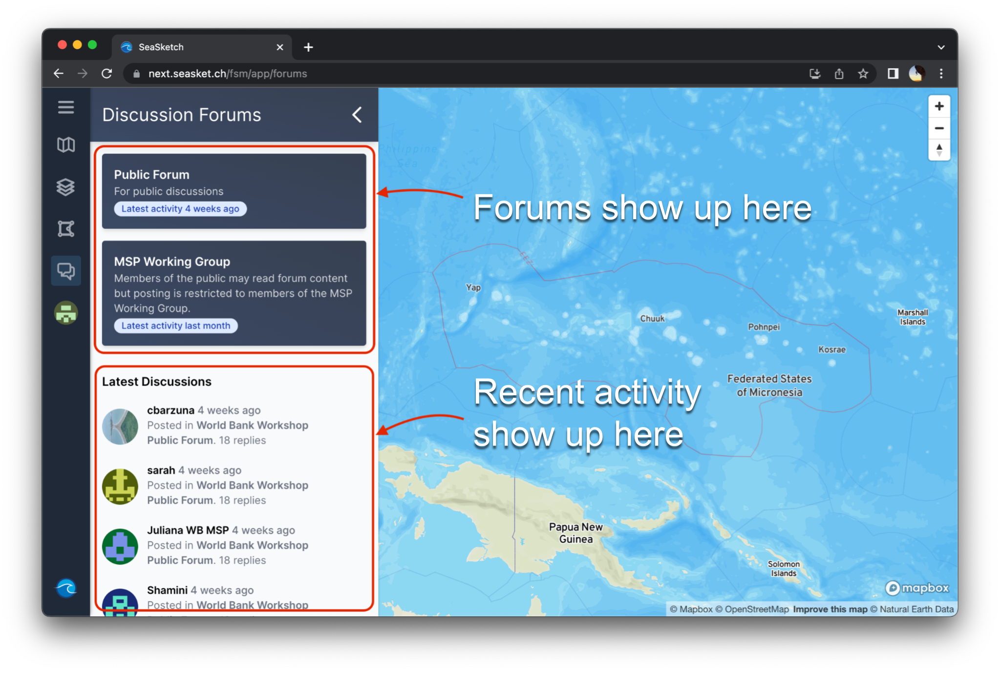
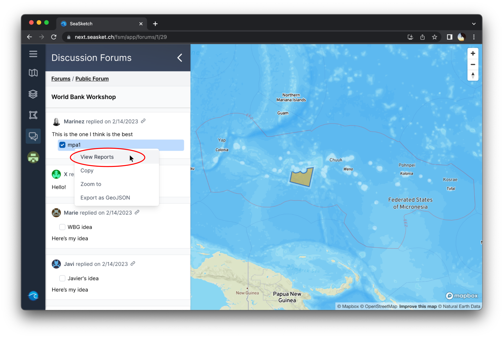
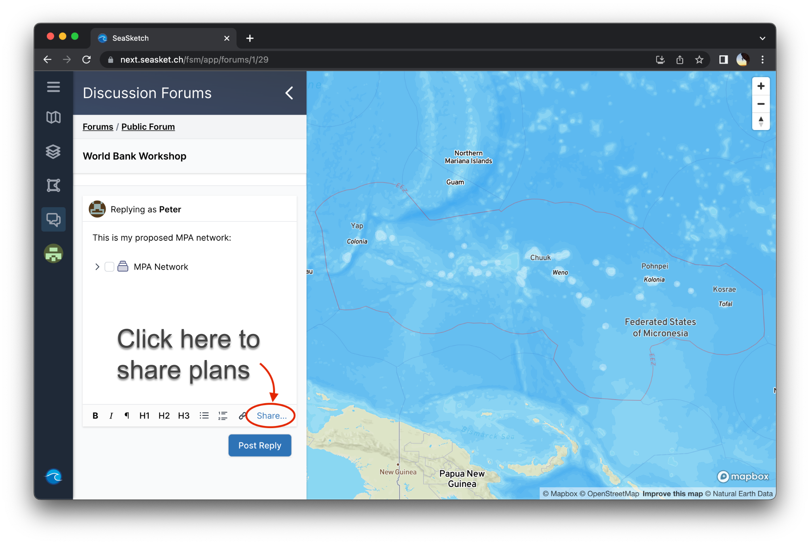

# Discussion Forums


This article covers:

* [Navigating discussion forums](discussion-forums.md#navigating-discussion-forums)
* [Viewing discussions and plans](discussion-forums.md#viewing-discussions-and-plans)
  * [Generating reports on plans](discussion-forums.md#generating-reports-on-plans)
* [Contributing to discussions and sharing plans](discussion-forums.md#contributing-to-discussions)


## Navigating Discussion Forums

To access a project's discussion forums, click 'Discussion Forums' or the comment symbol  in the main menu. The Discussion Forum layout is shown below.

<figure><figcaption>
Discussion forum interface
</figcaption></figure>

## Viewing Discussions and Plans

You can click on a forum and then a thread, or jump right into a thread on the 'Latest Discussions' feed. Once in a thread you'll likely see comments and plans from other project participants. A checkbox appears next plans — click the checkbox to add that plan to the map viewer.

<figure><figcaption>
Viewing a proposed plan in a discussion forum
</figcaption></figure>

### Generating reports on plans

You can view reports on plans same as in the Overlay Layers interface — simply right click on the plan and select 'View Reports'.

<figure><figcaption>
Viewing reports in discussion forums
</figcaption></figure>

## Contributing to Discussions

To contribute, scroll to the bottom of a thread — there you can type a reply and share plans.&#x20;

<figure><figcaption>
Replying to a discussion thread
</figcaption></figure>
