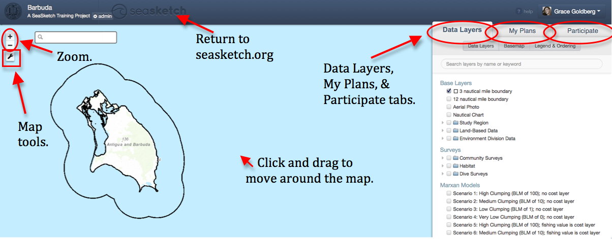
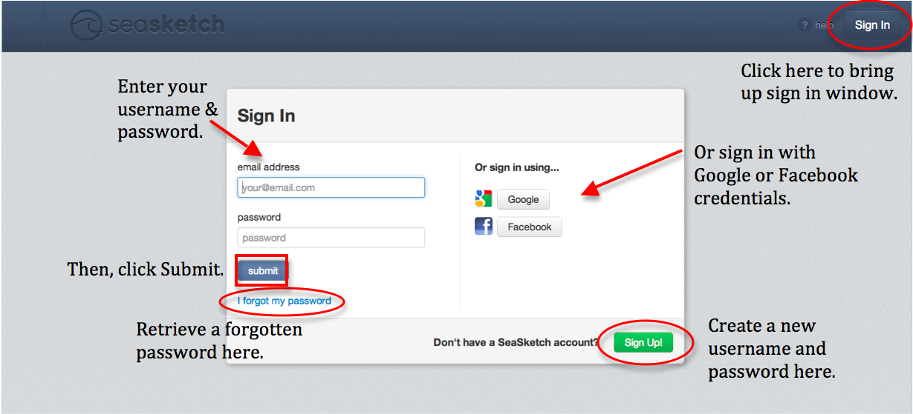
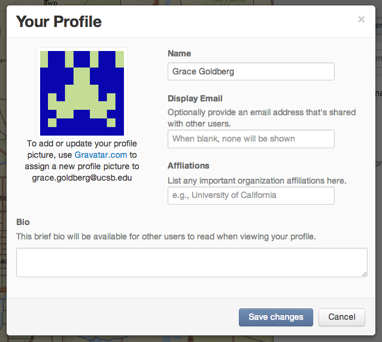

# Getting Started


This article covers:

* [An intro to the basic layout of a SeaSketch project](getting-started.md#basic-page-layout)
* [How to sign in, create an account, and edit your profile](getting-started.md#signing-in)
* [How to access help resources](getting-started.md#undefined)


## Basic Page Layout

When you have made it to your project homepage, read the About This Project window thoroughly.  Then, “x” out in the top right corner to begin using SeaSketch.

SeaSketch can be divided into a _**Map Viewer**_ on the left, with three main tabs on the right.  These three tabs contain the three main functions of the tool: _**Data Layers**_, _**My Plans**_ (for sketching, editing, and analyzing), and _**Participate**_ (with forums and surveys).

<figure><figcaption>
Basic layout of a SeaSketch project
</figcaption></figure>

Not all users will have access to all three tabs.  Project administrators may also set restrictions on what data you have access to, what forums and surveys are visible to you, which forums to which you can respond, and what types of sketches you can create.

_**To learn more about what you can do in the map viewer and the three tabs, read the introductory articles for each one, next up in this intro series!**_

## Signing In

To sign in, click 'Sign In' in the top right corner of the seasketch.org homepage, or any project page.  Here, you may enter your login credentials, or sign in using Google or Facebook. (see below for details).

<figure><figcaption>
Sign in using the window prompt
</figcaption></figure>

## Your Profile

In SeaSketch, your name and email are stored as a profile.  You can add a picture and a bio to this profile.

_**To access and edit your profile**_:

* Click on your name in the top right corner (make sure you’re signed in!)
* Select ‘My Profile’ from the drop down menu
* Edit the text fields in the Your Profile pop-up box, then click ‘Save Changes’          &#x20;

_**To change your gravatar icon**_ into a profile picture by selecting the link beneath your default gravatar icon and uploading a photo you wish to associate with your email.

<figure><figcaption>
Edit your profile 
</figcaption></figure>

## Help Center and Knowledge Base

If you are having trouble with SeaSketch, or forget how to complete a task, click '? help' in the upper right corner to access our help services.

Within our help portal, you may:

* Search and read helpful articles in the Knowledge Base \[which you may have already figured out if you're reading this ;)].  Always look for answers here before contacting our developers, as many common problems are already answered
* Contact us.  You may enter text about your question or problem, fill in your email address, and click Send message, to directly ask questions or communicate problems to SeaSketch developers
* Give Feedback.  You may give us feedback about SeaSketch features and functionality by clicking on “Give Feedback”
