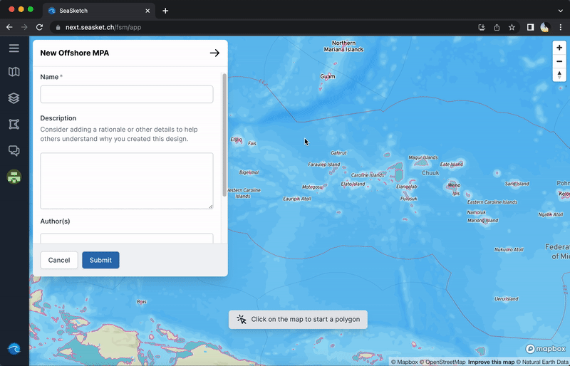
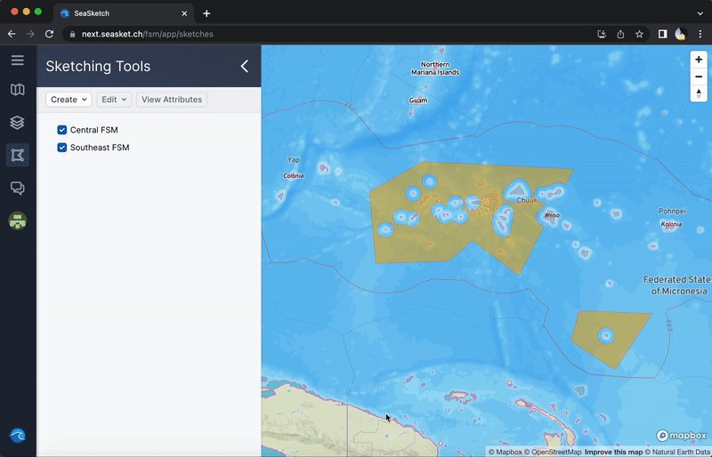

# Sketching Tools

## Navigate to Sketching Tools

To get started sketching, click 'Sketching Tools' or the polygon symbol  in the main menu. If you haven't made any sketches yet, the panel that appears will be blank as shown below.

<figure><figcaption>
Sketching Tools panel
</figcaption></figure>

## Create a New Sketch

To create a sketch, click  at the top of the panel. A dropdown menu will appear containing the various "sketch classes" that pertain to your project. The exact list of classes and parameters associated with each class tend to be unique to each project. If you're not sure which sketch class to use, talk to a project administrator.

<figure><figcaption>
Creating a new sketch
</figcaption></figure>

## Sketching

Once you've selected the type of sketch you want to create, you'll enter the sketching interface in which you can draw your desired area on the map and give it a name and description.&#x20;

### Sketching a shape

To start sketching, move your cursor onto the map viewer and click to create the first vertex of your polygon. From here, continue clicking to create additional vertices along the perimeter of your envisioned shape. When your shape is complete you can either double-click the end point or click your starting point to finish editing.&#x20;

<figure><figcaption>
Sketching a new shape
</figcaption></figure>

### Automatic Clipping

When you finish editing a shape, you'll see its boundary briefly light up and become animated. Once this is complete, some parts of your shape might be cropped or clipped out. Most sketch classes will automatically remove certain areas whether they be land, areas extending beyond EEZ boundaries, or other areas specific to the project.

<figure><figcaption>
In the process of clipping the newly drawn shape
</figcaption></figure>

### Editing and deleting shapes

Once your shape has finished clipping and appears green and static, you can delete or edit it by clicking on it.

To delete your shape and start over, simply click the trashcan symbol  in the menu near the bottom of the screen.

To edit your shape, you can drag existing vertices to new locations, or click and drag the smaller orange points between vertices to create new ones.

Click  at the bottom when finished.

<figure><figcaption>
Shape editing interface
</figcaption></figure>

If a sketch has already been created, you can still edit it by clicking it on the map viewer or right clicking its name in the left panel and hitting 'Edit'.

### Add name and description

Adding a distinctive name and informative description is crucial for collaborative planning efforts. You can add these details within the sketching interface.

<figure><figcaption>
Naming and describing newly created area
</figcaption></figure>

## Organizing Sketches

If you create multiple sketches, you can group them in a couple ways. You can create and add sketches to a folder — this is purely for organizational purposes. Or, if they are part of a proposed network of managed areas, you can compile them into a network. Networks can be assessed as a collective area when generating analytics reports. [More on reports below](sketching-tools.md#generating-reports).

To create a folder or network, click  and select the respective option from the dropdown menu. After giving the grouping a name (and description in the case of a network), you can drag and drop individual areas to add them to the group.

<figure><figcaption>
Creating a network and adding areas to it
</figcaption></figure>

## Reports

### Generating Reports

SeaSketch reports are a major part of what makes the platform such a powerful planning tool. Reports can tell you how your proposed protected area, or network of areas, meets conservation goals and impacts ocean use.

To generate a report, simply right click the name of the area or network in the left panel and hit  in the dropdown menu

<figure><figcaption>
Generating reports for "MPA Network"
</figcaption></figure>

### Navigating Reports

Reports contain at least two sections which you can navigate between using the tabs at the top of the report window. Two common sections are 'Viability' and 'Representation', as shown below. Scrolling down, you can view the various components of the report.
