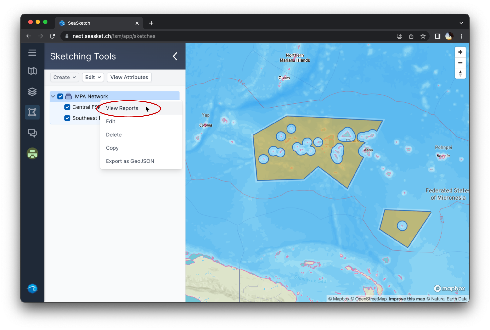

# Reports


This article covers:

[Reports](reports.md#reports)

* [Generating reports](reports.md#generating-reports)
* [Navigating reports](reports.md#navigating-reports)
* [Viewing report layers](reports.md#viewing-report-layers)


## Reports

### Generating reports

To generate a report, simply right click the name of the area or network in the left panel and hit  in the dropdown menu

<figure><figcaption>
Generating reports for "MPA Network"
</figcaption></figure>

### Navigating reports

Reports contain at least two sections which you can navigate between using the tabs at the top of the report window. Two common sections are 'Viability' and 'Representation', as shown below. Scrolling down, you can view the various components of the current section.

<figure><figcaption>
Report interface
</figcaption></figure>

### Viewing report layers

Each report metric is calculated using a specific data layer. You can view the associated layer in the map viewer with the 'Map' toggle  located to the right of the report item.

<figure><figcaption>
Viewing data layer associated with 'longline fishing effort'
</figcaption></figure>
