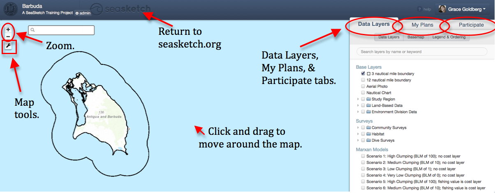
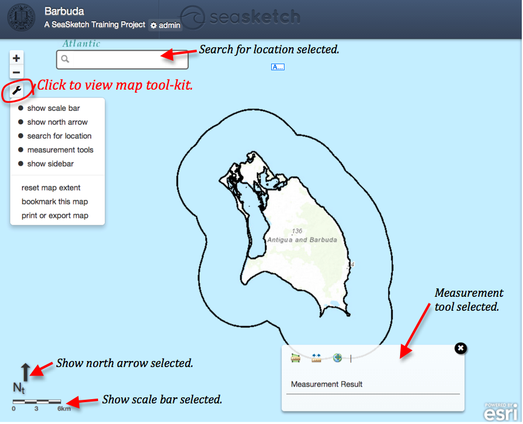
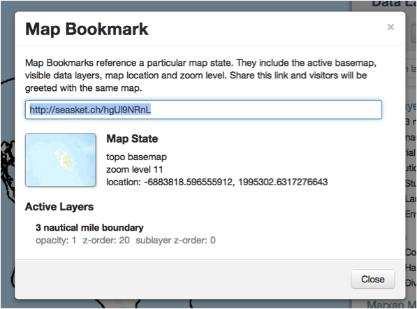
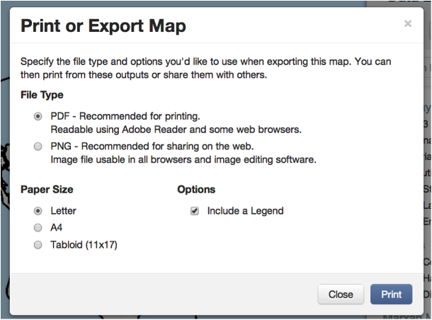
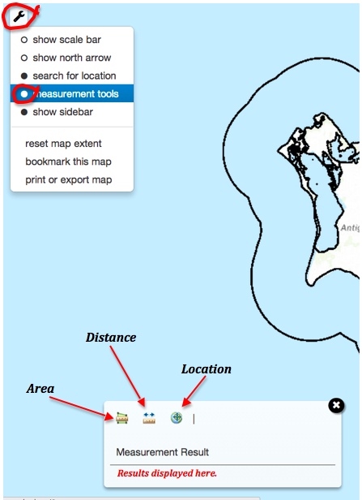

# The Map Viewer


This article covers:&#x20;

* [Exploring the map](the-map-viewer.md#what-can-i-do-in-the-map-viewer)
* [Accessing and using the map toolbox](the-map-viewer.md#accessing-and-using-the-map-toolbox)
* [Printing and exporting the map](the-map-viewer.md#undefined)
* [Using the map's measuring tools](the-map-viewer.md#undefined)


### Exploring the map

_To move around_ the map, click and drag.  You may also right click on the name of a specific data layer in the Data Layers tab at right, and select “Zoom to Extent” from the dropdown menu.

_To zoom in and out_, use the ‘+’ and ‘-‘ buttons in the top left corner of the map.

_To view information_ about a point or feature on the map, click directly on that feature on the map.  A pop-up box will appear with either information about the point or links to access more information.  Not all features have pop-ups associated with them.

<figure><figcaption>
A view of the map explorer
</figcaption></figure>

## Accessing and Using the Map Toolbox

Click on the wrench icon in the top left corner of the map viewer to show a dropdown menu of all map tools.

<figure><figcaption>
Using the map toolbox
</figcaption></figure>

You may select or unselect the **north arrow**, **scale bar**, **location search bar**, and **measurement tool** items to view or hide these features.  The measurement tools are discussed in detail below.

To use the **location search bar**, simply type the specific location you would like to search for in the search bar that appears in the top left corner.&#x20;

**Select show sidebar** to view or hide the tabs at right.  When you un-select this item, you are able to view the map in the full extent of your browser window, without the Data Layers, My Plans, and Participate tabs in view.

**Reset map extent** returns the map you are viewing to the original extent displayed in the project.  This map extent was saved by project administrators, and often shows the whole geographic scope of the project.

**Bookmark this map** allows you to save a link to the specific map extent you are currently viewing, and the data layers currently selected.  A pop-up box will appear with a link that you may copy, to share with others when discussing the map outside of SeaSketch.  The pop-up box also contains information about the extent and data layers saved in the bookmark.

## Bookmarking, Printing, and Exporting

**Bookmark this map** allows you to save a link to the specific map extent you are currently viewing, and the data layers currently selected.  A pop-up box will appear with a link that you may copy, to share with others when discussing the map outside of SeaSketch.  The pop-up box also contains information about the extent and data layers saved in the bookmark.

<figure><figcaption>
Bookmarking the map
</figcaption></figure>

**Print or Export Map** allows you to print the map you are currently viewing, and save them as a PNG image or PDF document.  You may choose the format of the document, and whether to include a legend with the map.  Click ‘Print’ to download the file document.  You may then print the document from your computer.

<figure><figcaption>
Printing and exporting the map
</figcaption></figure>

## Using the Measurement Tool

<figure><figcaption>
A view of the map measuring tools
</figcaption></figure>

_To access the measurement tools_, click the wrench icon in the top left hand corner of the map viewer, and select measurement tools from the drop down menu.\

_A measurement tools window_ will appear on the map.  This window contains area, distance, and geographic location measurement tools.  Close the window by clicking the ‘x’ in the top right corner.

_**Measure area**_

* Click the polygon ruler icon.
* Click directly on the map, at the vertices of the area you would like to measure.
* Double click to complete the polygon.&#x20;
* Area will be displayed below Measurement Results.

_**Measure distance**_ by clicking on the vector ruler icon.  Click on the map to create the path that you would like to measure.  Each click will place a flag on the map, so you can create complex paths, rather than simply distance between two points.  Double click to complete the path.  The total distance will be displayed below Measurement Results.

_**Measure location**_ of a point by clicking on the geographical point icon.  Click on the map in the place you would like to measure the coordinates.  A flag will mark the location selected.  To measure a different point, click the geographical tool icon to remove the first flag, and click the new location on the map to drop a new flag.
