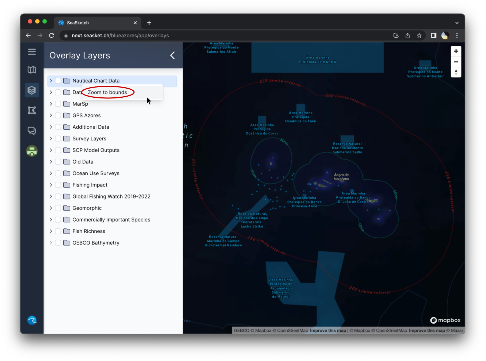
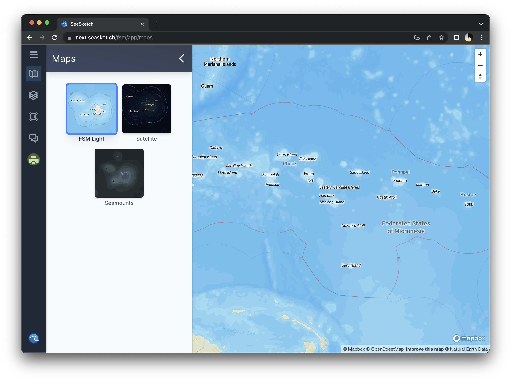

# The Map Viewer


This article covers:&#x20;

* [Exploring the map](the-map-viewer.md#what-can-i-do-in-the-map-viewer)
* [Choosing basemaps](the-map-viewer.md#choosing-basemaps)


### Exploring the map

_**To move around**_ the map, click and drag.&#x20;

_**To zoom in and out**_**,** you can use the and  buttons in the top right corner of the map, or the scroll wheel on your mouse (or equivalent hand gesture on a touchpad). Using the scroll wheel or touchpad offers more granular zooming.

_**To zoom in on a particular area**_, hold `shift` and click and drag your cursor. A rectangle should appear — this rectangle will become the new bounds of the mapviewer window.

_**To rotate the map or adjust the viewing angle**_, right click and drag. To return to a northward orientation, you can click the  button in the top right

<figure><figcaption>
Mapviewer interface layout
</figcaption></figure>

_**To zoom to the extent of a data layer**_**,** right click on the layer and and click 'Zoom to bounds'

<figure><figcaption>
Zoom to bounds of a particular data layer
</figcaption></figure>

## Choosing basemaps

SeaSketch allows you to choose between different mapviewer basemaps. The selection of basemaps depends on the project. To select a different basemap, click 'Maps' in the main menu or the map icon  if the menu is collapsed. You'll see the following panel and can click on your desired basemap:

<figure><figcaption>
Selecting a basemap for the mapviewer
</figcaption></figure>
